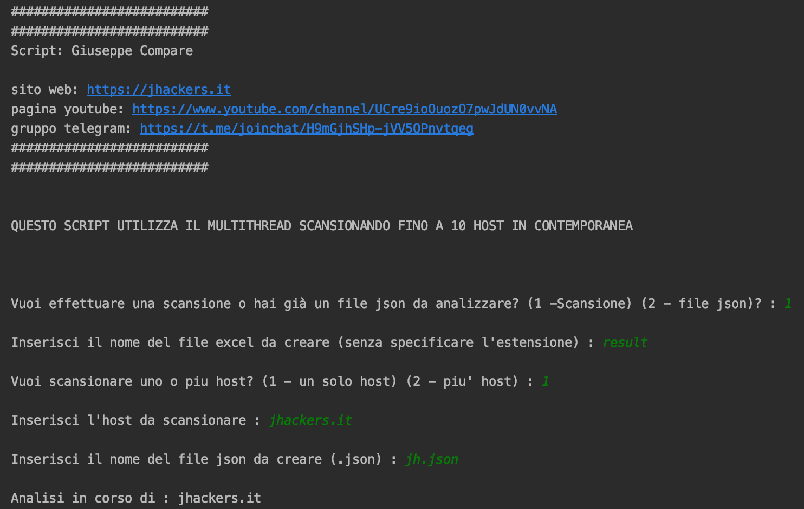
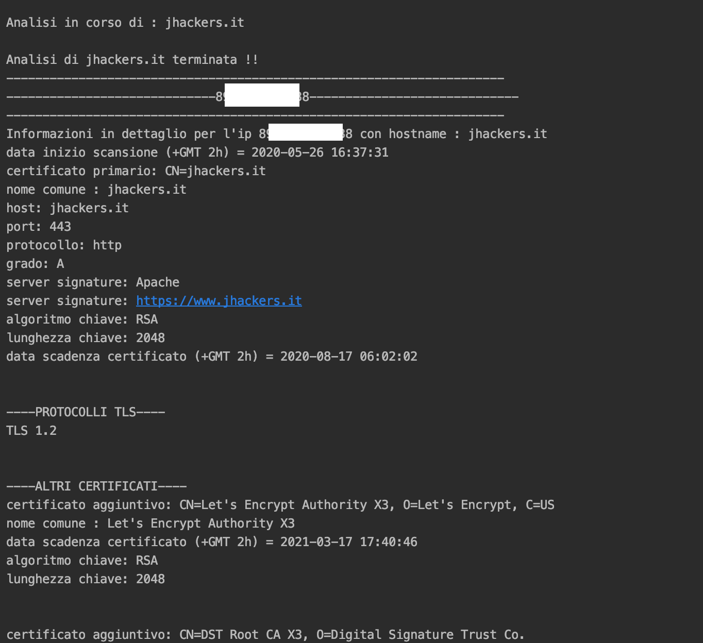
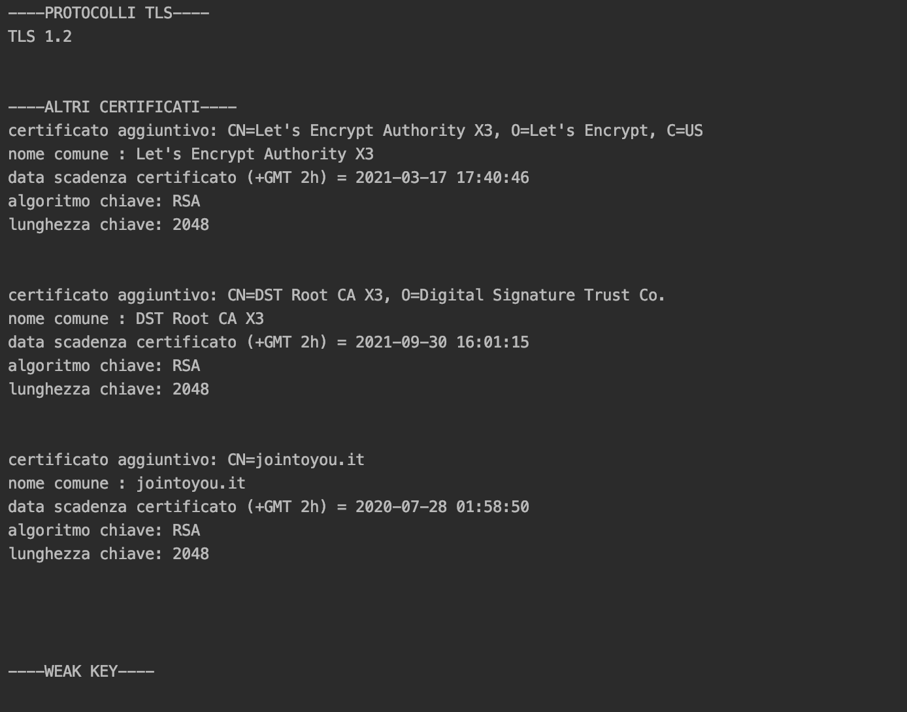
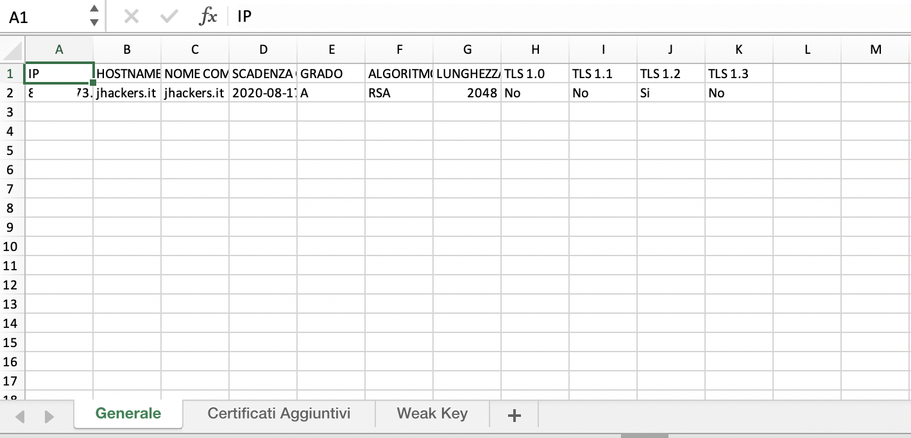
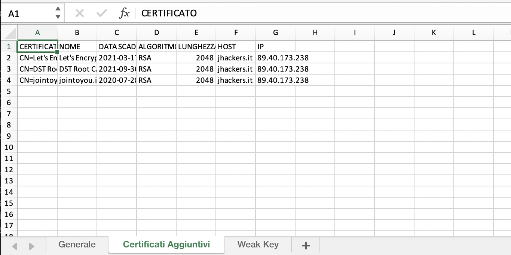
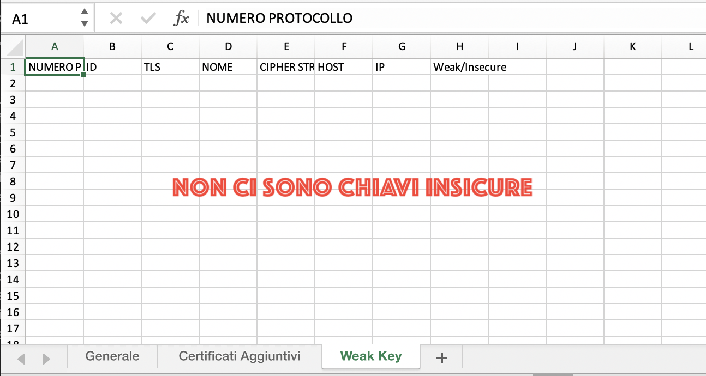
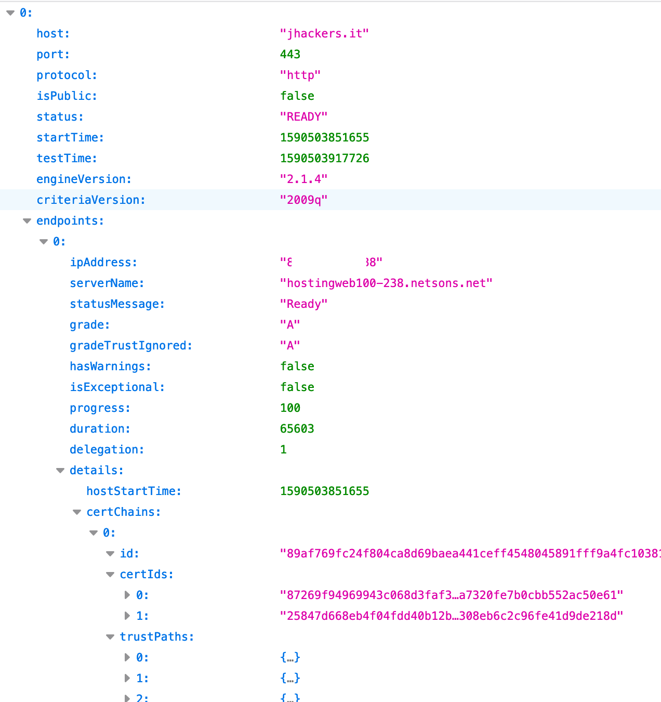

# SSLSCAN

Sslscan allow you to perform a certificates analysis on a target domain. There are 2 way to use the software :

1) sslscan (1 thread)
2) sslscan-multithreading

The second allow you to execute a scan on a large number of hosts faster than first because use multithreading. 

The software generate 2 file :

1) json
2) excel 

In the Excel file you can find all info about certificates ( like grade, expiry and weak keys ).

## Prerequisites

Python3

Sudo

## Installation

sudo pip3 install requests

sudo pip3 install datetime

sudo pip3 install xlsxwriter

sudo pip3 install openpyxl

sudo pip3 install xlrd

## Usage

python3 sslscan.py

You can decide to generate excel from json or perform a scan ( 1 host or a list of host saved in txt file ). The .txt file must be in the same directory of sslscan.py.

## Contributing
Pull requests are welcome. For major changes, please open an issue first to discuss what you would like to change.

## License
[MIT](https://github.com/jhacker91/sslscan/blob/master/License.txt)

## NB
Use only to scan your Server. Scanning other servers whitout authorization is a crime.

## Images

